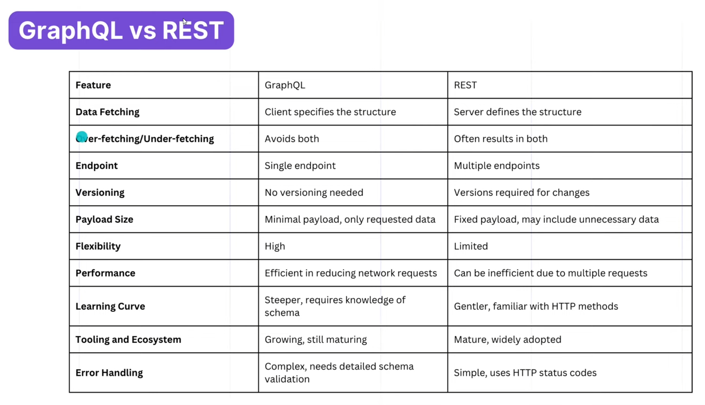
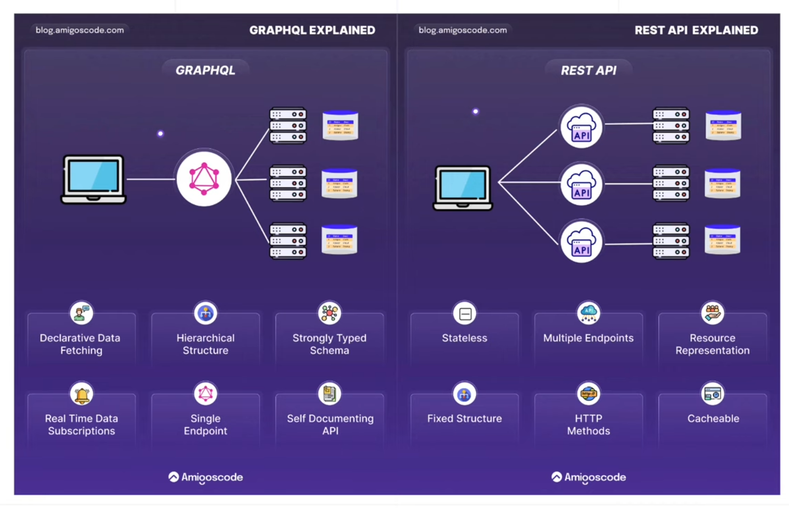
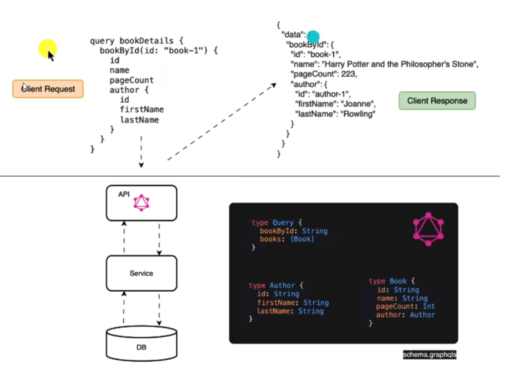

# java-graphql-example
Java graphql example

CONCETPS
* item1

* 

TECHNOLOGIES
* @QueryMapping + @Argument + @SchemaMapping
* @GraphQlTest + GraphQlTester

START UP APPLICATION
* brower UI for testing GraphQL queries.
Open: http://localhost:8080/graphiql
* doc: https://graphql.org/learn/mutations/

* calling the graphql api of BookController

``bash
curl --location 'http://localhost:8080/graphql' \
--header 'Content-Type: application/json' \
--data '{
    "query": "{\n  books {\n    author {\n      id\n      name\n    }\n  }\n  bookById(id: \"4\") {\n    id\n    name\n    pageCount\n    author {\n      id\n      name\n    }\n  }\n}\n"
}'
``